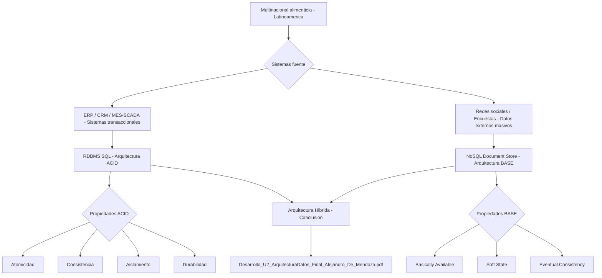

<div align="center">

# ESC420 — Arquitectura de Datos · Unidad 3
### Almacenamiento de Datos y Arquitecturas ACID y BASE

</div>

---

---

> **Institución:** Politécnico Grancolombiano  
> **Programa:** Maestría en Arquitectura de Software  
> **Módulo:** ESC420 — Arquitectura de Datos  
> **Unidad:** 3 — Ciclo de vida de la ingeniería de datos  
> **Estudiante:** Alejandro De Mendoza  
> **Docente:** Ing. Isabel Andrea Mahecha Nieto  
> **Fecha de entrega:** 10 de junio de 2026

---

## Descripción del Trabajo

Este repositorio contiene el desarrollo de la **Actividad No. 3** del módulo de Arquitectura de Datos, enfocado en el análisis de las formas de almacenamiento y los modelos de consistencia aplicables a una **multinacional latinoamericana del sector alimenticio**.

La organización estudiada opera en múltiples países de América Latina y gestiona un portafolio amplio que incluye galletas, snacks, embutidos, chocolates, cafés, helados y pastas. Sus operaciones son soportadas por un ecosistema heterogéneo de sistemas: **ERP, CRM, MES/SCADA, sistemas contables por país y herramientas DSS/BI**.

---

## Contenido del Análisis

### 1. Formas de Almacenamiento Propuestas

| Tecnología | Tipo | Aplicación en la organización |
|---|---|---|
| **Base de Datos Relacional (RDBMS)** | SQL | Datos transaccionales: ventas, inventarios, producción, contabilidad |
| **Base de Datos NoSQL (Almacén de Documentos)** | Document Store | Datos externos: redes sociales, encuestas, informes sectoriales |

### 2. Calidad de los Datos

Se evaluaron las siguientes dimensiones de calidad por cada forma de almacenamiento:

- **Completitud** — Presencia de todos los atributos requeridos
- **Consistencia** — Coherencia entre registros y sistemas
- **Exactitud** — Precisión de los valores almacenados
- **Vigencia** — Actualidad de la información
- **Unicidad** — Ausencia de duplicados
- **Trazabilidad** — Capacidad de rastrear el origen y transformaciones del dato
- **Integridad** — Mantenimiento de relaciones y restricciones

### 3. Arquitecturas de Consistencia: ACID vs BASE

```
┌─────────────────────────────────┬───────────────────────────────────┐
│           ACID                  │             BASE                  │
├─────────────────────────────────┼───────────────────────────────────┤
│ Atomicity    (Atomicidad)       │ Basically Available               │
│ Consistency  (Consistencia)     │ Soft State                        │
│ Isolation    (Aislamiento)      │ Eventual Consistency              │
│ Durability   (Durabilidad)      │                                   │
├─────────────────────────────────┼───────────────────────────────────┤
│ Ideal para operaciones críticas │ Ideal para alta disponibilidad    │
│ (ventas, contabilidad, ERP)     │ y grandes volúmenes (analytics,   │
│                                 │ datos externos, NoSQL)            │
└─────────────────────────────────┴───────────────────────────────────┘
```

### 4. Conclusión Arquitectónica

El análisis concluye que la multinacional requiere una **arquitectura híbrida**:

- **ACID + RDBMS** → para los sistemas transaccionales críticos (ERP, CRM, contabilidad, MES/SCADA) donde la integridad y consistencia son no negociables.
- **BASE + NoSQL** → para el almacenamiento y procesamiento de datos externos masivos, donde la disponibilidad y la escalabilidad tienen prioridad sobre la consistencia inmediata.

---

## Arquitectura



## Estructura del Repositorio

```
📁 esc420-arquitectura-datos-u3/
└── 📄 Desarrollo_U2_ArquitecturaDatos_Final_Alejandro_De_Mendoza.pdf
        └── Documento final — Actividad No. 3
```

---

## Material de Referencia (Unidad 3)

Los siguientes documentos del módulo fueron usados como base teórica:

- **LF1 — Ciclo de vida de la ingeniería de datos**: Fuentes de datos, OLTP/OLAP, bases de datos relacionales y NoSQL, arquitecturas ACID y BASE, bases de datos en la nube.
- **Actividad Formativa U3**: Lineamientos y rúbrica de evaluación de la actividad.

---

## Conceptos Clave

`arquitectura de datos` `ACID` `BASE` `NoSQL` `RDBMS` `calidad de datos`  
`consistencia eventual` `almacenamiento distribuido` `OLTP` `OLAP` `ERP` `CRM`

---

*Politécnico Grancolombiano · Bogotá D.C. · 2026*

---

## Autor

**Alejandro De Mendoza**  
Ingeniero Informático · Especialista en IA · Especialista en Ingeniería de Software · Máster en Arquitectura de Software

[](https://github.com/AlejoTechEngineer)
